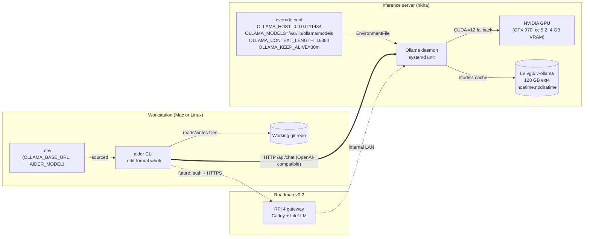

# Architecture

Technical overview of the `homelab-llm` stack: an Ollama inference server on a home GPU, an aider CLI agent
on the workstation, and the request path that connects them.

## High-level diagram

## Components

| Component | Role | Source | Pinned version |
|---|---|---|---|
| Ollama daemon | Inference engine; loads GGUF models, exposes `/api/chat` and `/v1/chat/completions`. | Official installer `https://ollama.com/install.sh`. | 0.30.6 (verified, rolling per CHANGELOG). |
| Qwen2.5-Coder 7B Q4_K_M | Default agentic model; ~4.7 GB quantized; partial-GPU offload on 4 GB VRAM. | `ollama pull qwen2.5-coder:7b`. | tag `qwen2.5-coder:7b`. |
| aider CLI | Code-editing agent; parses markdown code blocks, applies edits, optional auto-commit. | Homebrew on macOS, pipx on Linux. | 0.86.2 (verified, rolling). |
| GPU NVIDIA driver | Kernel module + userspace libs for CUDA. cc < 7.5 hardware uses `cuda_v12` fallback. | Distro packaging (`nvidia-driver-580` on Ubuntu 24.04). | 580.159.03 (verified). |
| systemd unit override | Pins Ollama runtime config (`OLLAMA_HOST`, `OLLAMA_MODELS`, `OLLAMA_CONTEXT_LENGTH`, `OLLAMA_KEEP_ALIVE`). | `/etc/systemd/system/ollama.service.d/override.conf`, generated by `scripts/02-install-ollama.sh`. | Tracked in repo, not in upstream Ollama. |
| LVM volume | Dedicated LV for model storage; survives root filesystem changes. | Created by `scripts/01-create-lvm-volume.sh`. | `vg0/lv-ollama`, 128 GB, ext4, `noatime,nodiratime`. |
| `.env` config | Operator-tunable values (host, port, mount, model tags). Gitignored. | Copy from `.env.example`. | Per-deployment. |

## Data flow per request

When the operator runs `aider --message "..."` against a working repo:

1. Source `.env` from the repo root so `OLLAMA_BASE_URL`, `AIDER_MODEL`, and `AIDER_EDIT_FORMAT` are exported.
2. aider constructs the request payload: a minimal system prompt, the registered tools (none, with
   `--edit-format whole`), the repo map, and the user message.
3. POST to `${OLLAMA_BASE_URL}/v1/chat/completions` (OpenAI-compatible) or `/api/chat` (native Ollama). aider uses the
   OpenAI-compatible path via the `ollama_chat/` LiteLLM provider.
4. The Ollama daemon receives the request, loads the model into VRAM if it is not warm
   (cold start ~25 s on this hardware; warm TTFT < 1 s).
5. Inference: GPU offload is **partial** for the 7B model on 4 GB VRAM (~49 % of layers on GPU, 51 % on CPU);
   the 3B model fits **fully** on GPU.
6. The response is streamed back. aider parses fenced code blocks per `--edit-format whole` and matches them
   to filenames in the prompt.
7. aider applies the edits to the working directory; if `--auto-commits` is set (default), it produces a commit
   with a Conventional Commits message and the AI attribution trailer.

## Why these choices

**Ollama as the inference engine.** Single-binary install, sane systemd integration, an OpenAI-compatible
endpoint plus a native one, and a model registry that handles download and quantization caching transparently.
The alternative — running `llama.cpp` directly — would have required hand-rolling the same daemon scaffolding.
See [ADR-0001](decisions/0001-ollama-as-inference-engine.md).

**Dedicated LVM volume for models.** The host has a volume group with several TiB of unallocated extents and
a root filesystem at ~52 % used. Putting `/var/lib/ollama` on a dedicated LV keeps model storage independent of
the root filesystem, lets us tune mount options (`noatime,nodiratime`), and makes uninstall a clean unmount + remove
rather than a recursive delete that risks scope creep.
See [ADR-0002](decisions/0002-storage-on-dedicated-lvm-volume.md).

**aider as the CLI client, not OpenCode.** aider parses markdown code blocks directly and does not require structured
`tool_calls[]` from the model. Qwen2.5-Coder under Ollama serializes tool calls into the `content` field as JSON
rather than into the structured `tool_calls[]` array, which silently breaks clients (OpenCode, Cline) that expect
the structured shape. See [ADR-0003](decisions/0003-aider-as-cli-agent-not-opencode.md).

**Qwen2.5-Coder 7B as the default model.** It is the largest model in the Qwen2.5-Coder family that fits the 4 GB VRAM
budget with partial offload (6.8–7.3 tok/s, TTFT ~1 s — usable for interactive editing), it speaks aider's `whole`
edit format reliably, and the 3B variant remains available as a fast fallback for trivial edits.
See [ADR-0004](decisions/0004-qwen25-coder-7b-as-default-model.md).

## Constraints and limitations

- **GTX 970 compute capability 5.2.** Below the cc 7.5 threshold of the Ollama 0.30.6 `cuda_v13` build, so the daemon
  falls back to the legacy `cuda_v12` binary. Inference works, but no tensor cores — expect roughly 50 % of the
  throughput of a 30xx-series card with the same VRAM.
- **4 GB VRAM ceiling.** The 7B model only fits with partial CPU offload; the 3B model fits entirely on GPU.
  Models larger than 7B (Qwen2.5-Coder 14B, 32B) do not fit and are out of scope on this hardware.
- **WiFi USB on the inference host.** Ping jitter measured 21–106 ms, which is acceptable for interactive aider turns
  but rules out wake-on-LAN (the USB interface drops on suspend) and adds avoidable latency for remote clients.
  Cable Ethernet to `eno1` is on the roadmap.
- **Tool-use compatibility.** Qwen2.5-Coder formats tool calls as JSON inside the `content` field rather than the
  structured `tool_calls[]` shape. aider tolerates this because it parses code blocks; OpenCode and Cline do not.
  See [ADR-0003](decisions/0003-aider-as-cli-agent-not-opencode.md).

## Out of scope (current)

This repo does **not** cover:

- Model training or fine-tuning (we consume off-the-shelf quantized models from the Ollama registry).
- Multi-GPU or multi-node inference.
- Kubernetes, container orchestration, or cluster deployment.
- Productive SLAs, high availability, disaster recovery, or formal qualification of any kind.
- Public-internet exposure (the gateway in v0.2 will add auth + HTTPS, but only on the LAN side at first).
